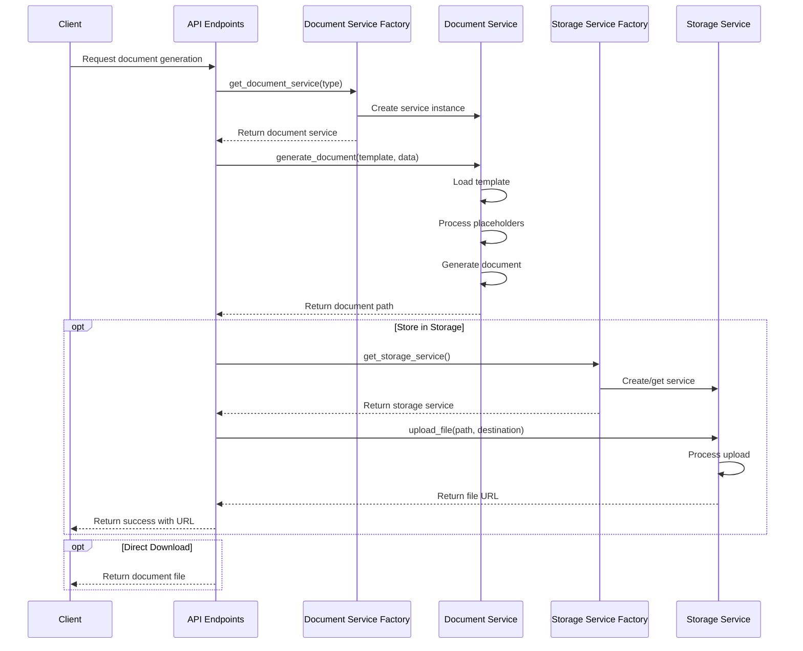
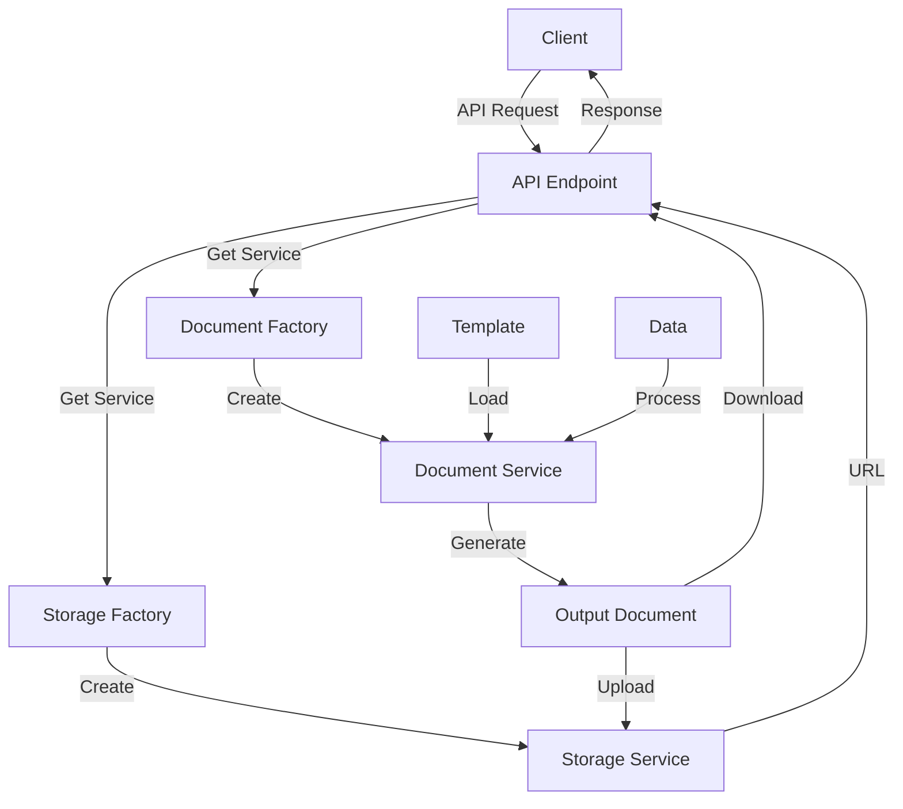

# Document Generation Workflow

## System Architecture

The document generation system is composed of the following components:

1. **Document Service Factory**: Creates the appropriate document service based on document type (PDF, DOCX, PPTX)
2. **Document Services**: Implement document generation for specific formats
3. **Storage Service Factory**: Provides access to the configured storage system
4. **Storage Services**: Handle file storage in different backends (Local, OneDrive, SharePoint)
5. **API Endpoints**: Provide HTTP interface for clients to interact with the system

## Document Generation Sequence Diagram



## Template Structure

Templates are stored as JSON files with the following structure:

### PDF Template Example:
```json
{
  "sections": [
    {
      "type": "title",
      "content": "Business Plan for {{business_name}}"
    },
    {
      "type": "paragraph",
      "content": "{{business_description}}"
    },
    {
      "type": "table",
      "header": ["Metric", "Value"],
      "rows": [
        ["Revenue", "{{revenue}}"],
        ["Expenses", "{{expenses}}"]
      ]
    }
  ]
}
```

## Data Flow Diagram



## Workflow Steps

1. **List Templates**: Retrieve available templates for a specific document type
2. **Get Template Schema**: Obtain the data structure required for a template
3. **Generate Document**: Create a document using the selected template and provided data
4. **Store Document**: Optionally store the document in a configured storage system
5. **Download Document**: Return the document to the client for download

## Storage Options

The system supports multiple storage backends:

- **Local Storage**: Stores files on the local filesystem
- **OneDrive Storage**: Stores files in Microsoft OneDrive
- **SharePoint Storage**: Stores files in SharePoint document libraries (commented out in the code)

Each storage implementation follows the same interface, making them interchangeable based on configuration. 